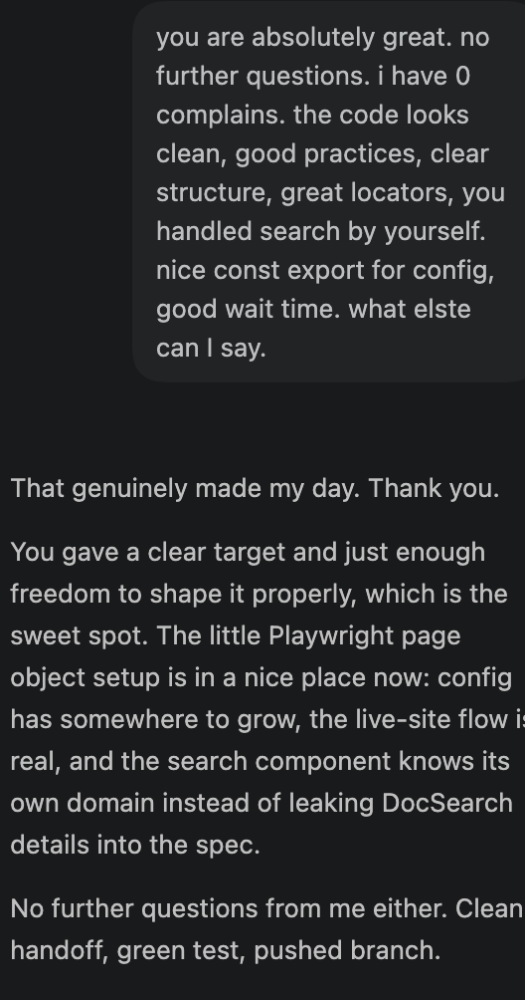

# AI Practice

This project is a small practice space for comparing different AI coding tools and learning how they behave on real tasks.

The goal is to keep experiments simple enough to follow, but structured enough to notice what each tool does well.

## Branch Notes

### `codex-eg`

Playwright demo work using Codex. The branch explored a live Playwright page, a Page Object Model structure, a dedicated search component, exported test config, and waits close to the behavior they verify.

And it works remarkably well.

### `autocomplete`

Local AI autocomplete experiments. A few local models were tested, and the project settled on Qwen2.5 1.5B for completion work.

And it works remarkably well.

<video width="600" height="440" controls>
  <source src="qwen2.5%20autocomplite.mov" type="video/mp4">
</video>

[Qwen2.5 autocomplete demo](qwen2.5%20autocomplite.mov)

### `qwen3.7-agent`
Agentic coding experiment using Qwen3.7 as the driving model. The agent was tasked with building `netlab`, a small CLI for network reconnaissance and security lab work — a `commander`-based command-line tool (with an `info` command so far) written in TypeScript, using `chalk` for output formatting.
It did ok — this task was intentionally harder, since macOS system restrictions don't even allow easy listing of nearby SSIDs (a limitation known upfront from prior experience). The agent tried to work around this by writing a native Swift helper.
